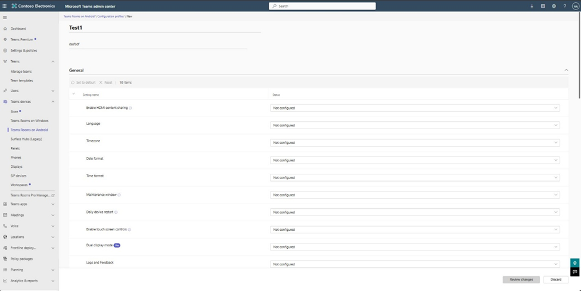
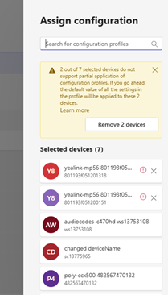

# Manage devices in Teams 

You can manage devices used with Microsoft Teams in your organization from the Microsoft Teams admin center or in Teams Rooms Pro Management. You can view and manage the device inventory for your organization and do tasks such as update, restart, and monitor diagnostics for devices. You can also create and assign configuration profiles to a device or groups of devices.

To manage devices, such as change device configuration, restart devices, manage updates, or view device and peripheral health, you need to be assigned one of the following Microsoft 365 admin roles:

- Teams Service admin
- Teams Device admin

For more information about admin roles in Teams, see [Use Teams administrator roles to manage Teams](../using-admin-roles.md).

For more information about Teams Rooms Pro management role based access control, see [Role-based access control in the Microsoft Teams Rooms Pro Management Portal](../rooms/rooms-pro-rbac.md).

## What devices can you manage?

You can manage any device that's certified for, and enrolled in, Teams. A device is automatically enrolled the first time a user signs in to Teams on the device. For a list of certified devices that can be managed, see:

- [Microsoft Teams Rooms](https://www.microsoft.com/microsoft-365/microsoft-teams/across-devices/devices/category?devicetype=20)
- [Conference phones](https://products.office.com/microsoft-teams/across-devices/devices/category?devicetype=73)
- [Desk phones](https://products.office.com/microsoft-teams/across-devices/devices/category?devicetype=34)
- [Teams displays](https://www.microsoft.com/microsoft-365/microsoft-teams/across-devices/devices/category?devicetype=34)
- [Teams panels](teams-panels.md)

To manage devices, in the left navigation of the [Microsoft Teams admin center](https://admin.teams.microsoft.com), go to **Teams Devices**, and then select the device type. Each type of device has its own respective section, which lets you manage them separately.

## Manage Teams Rooms in Teams Rooms Pro Management

To manage devices in Teams Rooms Pro Management, see [Microsoft Teams Rooms Pro Management Portal](../rooms/managed-meeting-rooms-portal.md).

## Manage Teams Rooms on Windows devices in Teams Admin Center

You can use the Teams admin center to view and remotely manage your Teams Rooms on Windows devices across your organization. The Teams admin center makes it easy to see, at a glance, which devices are healthy and which need attention, and lets you focus on specific devices to see detailed information about device health, meeting performance, call quality, and peripherals.

Here are some things you can do to manage your Teams Rooms devices. Teams Rooms devices can be found in the [Microsoft Teams admin center](https://admin.teams.microsoft.com) under **Teams Devices** > **Teams Rooms on Windows**.

For details about how to manage your Teams Rooms devices, see [Manage Microsoft Teams Rooms](../rooms/rooms-manage.md).

| To do this...                          | Do this                                                                                                                                                                                                                                                                                                                                                                          |
|----------------------------------------|----------------------------------------------------------------------------------------------------------------------------------------------------------------------------------------------------------------------------------------------------------------------------------------------------------------------------------------------------------------------------------|
| Change settings on one or more devices | Select one or more devices > **Edit settings**. If you select multiple devices, the values you change will replace the values on all the selected devices.                                                                                                                                                                                                                       |
| Restart devices                        | Select one or more devices > **Restart**. When you restart a device, you can choose whether to restart the device immediately or select **Schedule restart** to restart the device at a specific date and time. The date and time you select are local to the device being restarted.                                                                                            |
| View meeting activity                  | Select a device name to open device details > **Activity**. When you open the **Activity** tab, you can see all the meetings that the device has participated in. This summary view shows the meeting start time, the number of participants, its duration, and the overall call quality.                                                                                        |
| View meeting details                   | Select a device name to open device details > **Activity** > select a meeting. When you open a meeting's details, you can see all of the participants in the meeting, how long they were in the call, the Teams session types, and their individual call quality. If you want to see technical information about a participant's call, select the participant's call start time. |

## Manage phones, Teams Rooms on Android, Teams displays, and Teams panels

In the Teams admin center, you can view and manage phones, Teams Rooms on Android, Teams displays, and Teams panels enrolled in Teams in your organization. Information that you'll see for each device includes device name, manufacturer, model, user, status, action, last seen, and history. You can customize the view to show the information that fits your needs.

Phones, Teams Rooms on Android, Teams displays, and Teams panels are automatically enrolled in Microsoft Intune if you've signed up for it. After a device is enrolled, device compliance is confirmed and conditional access policies are applied to the device.

Here are some examples of how you can manage phones, Teams Rooms on Android, Teams displays, and Teams panels in your organization.  

| To do this...                           | Do this                                                                                                                                                                                                                                                                                                      |
|-----------------------------------------|--------------------------------------------------------------------------------------------------------------------------------------------------------------------------------------------------------------------------------------------------------------------------------------------------------------|
| Change device information               | Select a device > **Edit**. You can edit details such as device name, asset tag, and add notes.                                                                                                                                                                                                              |
| Manage software updates                 | Select a device > **Update**. You can view the list of software and firmware updates available for the device and choose the updates to install. For more information about updating devices, see [Update Teams devices remotely](remote-update.md)                                                          |
| Assign or change configuration policies | Select one or more devices > **Assign configuration**.                                                                                                                                                                                                                                                       |
| Add or remove device tags               | Select one or more devices > **Manage tags**. For more information about device tags, see [Manage Teams device tags](manage-device-tags.md).                                                                                                                                                                 |
| Restart devices                         | Select one or more devices > **Restart**.                                                                                                                                                                                                                                                                    |
| Filter devices using device tags        | Select the filter icon, select the **Tag** field, specify a device tag to filter on, and select **Apply**. For more information about filtering devices using device tags, see [Use filters to return devices with a specific tag](manage-device-tags.md#use-filters-to-return-devices-with-a-specific-tag). |
|Schedule device actions|Actions like **Restart** and **Software update** can be scheduled for the preferred date and time.|
| View device history and diagnostics     | Under the **History** column, click the **View** link for a device to view its update history and diagnostic details.                                                                                                                                                                                         |
|View device action details|In the **History** tab on the device page, select the action status to view the details of the action.|
|Cancel device actions|From the **History** section, you can cancel any action that is in a Queued or Scheduled state (not in progress or completed) to prevent execution. This option is accessible from the **History** tab in the device page and the **History** column in the list page. You can select multiple actions to cancel at once. Paired actions will be canceled together if execution hasn't started.|
|Actions on multiple devices|You can select multiple devices from the list page and perform an action on them at once. This is applicable for **Restart**, **Software update**, **Assign configuration**, **Manage tags**, **Remove device**, and **Sign-out**.|

This video shows how to search for Teams devices.

> [!VIDEO https://learn-video.azurefd.net/vod/player?id=bdf18709-a9fd-487e-a80b-e570ffe536b9]

### View issues with Android-based Teams devices

You can view issues with Android-based Teams devices in the health status column of the device list.

In addition to the health status of the device, the following issues are also surfaced in the health status column:

1. **Sign-in errors exist** - There was an issue signing-in to the device. Select the health status of the device to view the time the sign-in failure occurred, the account that attempted to sign into the device, the reason for the failure, and a history of previous sign-in failures.
2. **No connection** - The connection between Teams admin center and the device has been lost. Restart or update the device through Teams admin center to resolve this error.
3. **Multiple issues** - One or more errors exist. Select the health status of the device to view the list of issues.

> [!NOTE]
> If you don't see any issues for a device you're having trouble with, make sure the device's firmware is on the latest version.

### Use configuration profiles in Teams

Use configuration profiles to manage settings and features for different Teams Android devices in your organization, including Teams Rooms on Android, Teams displays, Teams phone, and Teams panels. You can create a configuration profile to include settings and features you want to enable or disable and then assign it to a device or set of devices. 

> [!IMPORTANT]
> We have made few changes in the current configuration profile design to support Partial application of configuration profiles. With this update, you can now configure and apply only the necessary settings without unintentionally overriding other existing settings on the device. Read on to know more.

Here are the different scenarios you can utilize configuration profiles for your Teams device settings management.

#### Create a configuration profile

To create a configuration profile for a Teams device type:

1. In the left navigation, go to **Teams Devices** > select the Teams device type > **Configuration profiles**. For example, select **Teams Devices** > **Teams panels** > **Configuration profiles** to create a new configuration profile for Teams panels.
1. Click **Add**.
1. Enter a name for the profile and optionally add a friendly description.
1. By default, all the settings in the profile will be in “Not configured” state

1. Change the settings you want for the profile from “Not configured” to the required value, and then click __Review changes__.

1. A “Review configured settings” pop up appears. Compare and review the current and new values of the settings that were changed. Click on __Save changes.__

1. The newly created configuration profile is displayed in the list of profiles.  

#### Assign a configuration profile

After creating a configuration profile for a Teams device type, assign it to one or more devices.

1. In the left navigation, go to **Teams Devices** > select the Teams device type. For example, to assign a configuration profile to a Teams panels device, select **Teams Devices** > **Teams panels**.
1. Select one or more devices, and then click **Assign configuration**.  
1. In the **Assign a configuration** pane, search for configuration profile to assign to the selected devices.
1. Click **Apply**.

1. For the devices to which you applied the configuration profile, only the settings that were changed and reviewed by the admin will be configured.

1. The status of the configuration profile assignment can be checked for the device, in the History tab. The __Action__ column displays __Config Update__ and the __Configuration profile__ column displays the configuration profile name.

1. If the OEM of any of the selected devices do not support **Partial application of configuration profiles** feature yet, you will see a warning in the Assign a configuration pane as below  

Below is the list of the OEMS and their minimum firmware versions that have the support of Partial application of configuration profiles feature.

   |OEM|Device type|Minimum FW version|
   | -------- | -------- | -------- |
   |Audiocodes|Phones|AOSP Firmware: 2.3.497|
   |Audiocodes|MTR-A, Panels|AOSP Firmware: 2.8.208|
   |Cisco|MTR-A, Panels|AOSP Firmware: 11.24.1.8|
   |DTEN|MTR-A|D7X 1.6.13 + Bar 1.3.13 + Mate 2.3.13_AOSP|
   |Poly|Phones|9.1.0.9017|
   |Yealink|Phones|122.15.0.166_CP|
   
#### Edit an existing configuration profile

To edit an existing configuration profile,

1. In the left navigation, go to __Teams Devices__ > select the Teams device type > __Configuration profiles__. For example, select __Teams Devices__ > __Teams panels__ > __Configuration profiles__ to edit an existing configuration profile for Teams panels.

1. Click on the configuration profile you want to edit. Change the settings you want for the profile and click on __Review changes.__

1. A “Review configured settings” pop up appears. Compare and review the current and new values of the settings that were changed. Click on __Save changes.__

1. The changes in the settings will be automatically applied to the devices that has the configuration profile assigned.

1. In the left navigation, go to __Teams Devices__ > select the Teams device type > __Configuration profiles__. For example, select __Teams Devices__ > __Teams panels__ > __Configuration profiles__ to edit an existing configuration profile for Teams panels.

1. Click on the configuration profile you want to edit. Change the settings you want for the profile and click on __Review changes.__

1. A “Review configured settings” pop up appears. Compare and review the current and new values of the settings that were changed. Click on __Save changes.__

1. The changes in the settings will be automatically applied to the devices that have the configuration profile assigned.

#### Reassign an existing configuration profile

To reassign a configuration profile to the existing assigned devices, without making any changes to settings

1. In the left navigation, go to __Teams Devices__ > select the Teams device type > __Configuration profiles__. For example, select __Teams Devices__ > __Teams panels__ > __Configuration profiles__ to edit an existing configuration profile for Teams panels.

1. Click on the configuration profile you want to reassign and scroll to the bottom to find the __Reassign config__ CTA.

1. Click on the __Reassign config__ CTA, review the configured settings and __Save changes__.

1. The configuration profile will be automatically applied to all the devices that have this profile already assigned.

> [!NOTE]
> As part of the new Partial Application design for configuration profiles, the **"Set device lock"** setting has been removed from MTR-A and Teams Panels profiles. This setting is not applicable to shared devices and does not function as expected in those scenarios, so it has been excluded to avoid confusion.

#### Frequently asked questions

1. What is partial application of configuration profiles?  
*Previously, when a configuration profile was assigned to a device, **all settings** in the profile, including those left unconfigured, were applied with their **default values**. This often caused **unintended changes**, especially to critical settings like **language** and **time zone**, which differ across regions.*

   *With **Partial Application of Configuration Profiles**, admins now have greater **control and visibility**. Only the settings that are **explicitly configured** in the profile will be applied—ensuring that existing device settings remain unchanged unless intentionally modified. This helps prevent disruptions and simplifies large-scale device management.*
   
1. What if a device doesn't support partial application of configuration profiles?  
I*f a configuration profile is assigned to a device that doesn't support Partial application of configuration profiles, then all the settings in the profile, including those left unconfigured, will be applied with their default values (which is basically the behavior of the previous implementation of configuration profiles).*

1. What happens to the existing configuration profiles created before the launch of Partial application of configuration profiles feature?  
*All existing configuration profiles created prior to the launch will **automatically support** the Partial Application feature. Since these profiles had all settings explicitly configured with default values, they will continue to be shown with the same values in the new design.*

   *If you want to stop applying certain settings, simply change their value to **"Not configured"** and click **Save**. Only the configured settings will then be applied moving forward.*
   
1. What does **"Not configured"** mean in the new configuration profile design?   
*In the new design, any setting marked as **"Not configured"** will **not** be applied to the assigned devices. Instead, the existing value already present on the device will remain unchanged. This allows admins to update only the necessary settings without affecting others.*

#### Best practices for managing configuration profiles

When configuring Teams Android devices, especially in organizations with multiple locations and different device configurations, managing configuration profiles can become complex. Teams Android devices allow for a variety of settings (e.g., Language, Timezone, Touch controls, Dual display mode, and Whiteboard) which may require the creation of multiple profiles to meet the needs of different teams, rooms, or locations. Here are key considerations for effective management: 

1. **Create one profile per configuration set** - You’ll need a separate profile for each combination of settings. For example, if you manage rooms in different time zones, you’ll need a distinct configuration profile for each time zone. Settings like **Touch controls** or **Dual display mode** require additional profiles to account for variations in devices. For example, for rooms in Berlin with the same timezone, you would need at least three configuration profiles:

   1. Touch controls set to OFF, Dual display mode set to OFF (for single display devices with console)
      
   1. Touch controls set to OFF, Dual display mode set to ON (for dual display devices with console)
      
   1. Touch controls set to ON, Dual display mode set to OFF (for touch board devices)

1. **Adopt a systemic naming convention** - As new features and settings are added, existing profiles may need duplication. While this increases the number of profiles, it is necessary to ensure that each room or device type receives the appropriate configuration. Use a systemic naming convention that clearly indicates the variable settings included in each profile to stay organized (e.g., Berlin-Timezone-Touch-NoDualDisplay). This will help ensure that profiles are easily identifiable and prevent confusion when applying them to different rooms. 

1. **Group devices by shared configuration needs** - As your deployment grows, group devices with shared configurations to minimize the number of profiles. As Teams Android devices features evolve, keep an eye on new settings that may require additional profiles. Always ensure that each device receives the precise configuration it requires. 

By maintaining a clear structure for your profiles and carefully managing device specific settings, you can ensure smoother deployment and operation of Teams Android devices across your organization. 
