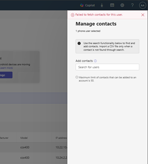
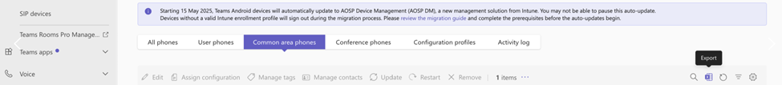

---
# Required metadata
# For more information, see https://learn.microsoft.com/en-us/help/platform/learn-editor-add-metadata
# For valid values of ms.service, ms.prod, and ms.topic, see https://learn.microsoft.com/en-us/help/platform/metadata-taxonomies

title: Remote management of contacts for Teams Phones
description: IT Admins can remotely add or delete contacts from their Teams Phones using Teams admin center
author:      ArchanaYerragangu # GitHub alias
ms.author:   ayerragangu # Microsoft alias
ms.service: msteams
ms.subservice: teams-calling
ms.topic: article
ms.date:     07/21/2025
---

# Remote management of contacts for Teams Phones

This article provides guidance on the remote management of contacts on Microsoft Teams certified Phones using the Teams admin center. This feature allows users to easily access emergency or frequently used contacts available in the Company contacts folder on Teams Phones.

> [!NOTE]
> This feature is currently available only for common area phones

#### Steps for managing contacts in Teams admin center

To manage contacts on Teams phones through the Teams admin center, follow these steps:

- __Update the Teams phone to version 1449/1.0.94.2025062601 or later:__ After updating the phone, you will notice changes. To update your Teams phones, refer to [Update your phones remotely](/microsoftteams/phones/remote-update-teams-phones). Ensure that you are running Android version __1449/1.0.94.2025062601__ or later.

- Sign in to the Teams admin center.

- Navigate to Teams devices > Phones > click on the Common area phones tab.

- To add contacts to the __Company contacts__ folder:

  - Select the devices for which you want to add contacts, then click __Manage Contacts__.
  
  - A right pane opens. In the __Add contact__ search box, search and select the desired contacts.
  
  - If you cannot find contacts in the search box, use the __Import contacts__ option. A sample CSV file is available for download.
    
  - Click __Save__.
  
  - The contacts sync to the __Company contacts__ folder within approximately 24 hours.
  
- To delete contacts from the __Company contacts__ folder:

  - Select the device from which you need to delete contacts, then click __Manage Contacts__.
  
  - In the right pane, remove the applicable contacts and click __Save__.
  
  - Confirm the deletion in the pop-up that appears.
  
#### Permissions to manage contacts:

You must have mailbox permissions to manage contacts for Teams Devices accounts. Without these permissions, you encounter an error in TAC when attempting to view or add contacts.



In these situations, refer to the Mailbox Permission Script Execution Guide provided below and add the necessary permissions to the relevant accounts.

### Mailbox Permission Script Execution Guide

**Overview**

This guide provides step-by-step instructions for an admin user to execute a PowerShell script that grants FullAccess mailbox permissions in bulk using a CSV file. The script supports Modern Authentication (MFA/Authenticator app) and logs all actions.

**Prerequisites**

- Windows PowerShell 5.1 or later (or PowerShell Core)

- PowerShell script file (grant_mailbox_permissions.ps1)

**Export the Common area phones inventory from TAC**

Export and Download the CSV file from TAC Common area phones screen.  


Running the Script

- Open PowerShell as Administrator.

- Navigate to the folder containing the script and CSV file: *cd "C:\Path\To\Your\Folder"*

- Run the script:

```powershell
#Install and import the Exchange Online module if not already installed
Install-Module -Name ExchangeOnlineManagement -Scope CurrentUser -Force Import-Module ExchangeOnlineManagement

#Prompt for admin UPN only (no password)
$adminUser = Read-Host "Enter the Admin User UPN (e.g., 

#Prompt for CSV file path (no double quotes in the file path)
$csvPath = Read-Host "Enter the full path to your CSV file (e.g., C:\scripts\user_upns.csv no quotes)"

#Connect to Exchange Online (interactive login, supports MFA)
Connect-ExchangeOnline -UserPrincipalName $adminUser

#Log file path
$logPath = "mailbox_permission_log.txt"

#Import the CSV file
$users = Import-Csv -Path $csvPath

foreach ($user in $users) { $userUPN = $user.UPN $serialNumber = $user.'Serial Number' if ([string]::IsNullOrWhiteSpace($userUPN)) { $logEntry = "$(Get-Date -Format 'yyyy-MM-dd HH:mm:ss') SKIPPED: Missing UPN for Serial Number $serialNumber" Write-Host $logEntry -ForegroundColor Yellow Add-Content -Path $logPath -Value $logEntry continue } try { Write-Host "Adding FullAccess permission for $adminUser to $userUPN's mailbox..." Add-MailboxPermission -Identity $userUPN -User $adminUser -AccessRights FullAccess -InheritanceType All -ErrorAction Stop $logEntry = "$(Get-Date -Format 'yyyy-MM-dd HH:mm:ss') SUCCESS: Added FullAccess for $adminUser to $userUPN" Write-Host $logEntry -ForegroundColor Green } catch { $logEntry = "$(Get-Date -Format 'yyyy-MM-dd HH:mm:ss') ERROR: Failed to add FullAccess for $adminUser to $userUPN. Error: $_" Write-Host $logEntry -ForegroundColor Red } Add-Content -Path $logPath -Value $logEntry }

Write-Host "Script completed. Check $logPath for details."


```

- Enter the Admin User UPN when prompted.

- Enter the full path to your CSV file when prompted.

- Authenticate using your usual method (including Authenticator app if necessary).

**Script Behavior**

- Connects to Exchange Online using your admin account (supports MFA).

- Reads each row in your CSV file.

- If the UPN is missing, logs a SKIPPED entry with the Serial Number.

- If the UPN is present, attempts to grant FullAccess permission.

- Logs SUCCESS or ERROR for each attempt in mailbox_permission_log.txt.

**Sample Log Entries**

2025-07-23 20:00:01 SUCCESS: Added FullAccess for admin@yourdomain.com to [user1@domain.com](mailto:user1@domain.com) 2025-07-23 20:00:02 ERROR: Failed to add FullAccess for admin@yourdomain.com to user2@domain.com. Error: <error details> 2025-07-23 20:00:03 SKIPPED: Missing UPN for Serial Number 99999

**Troubleshooting**

- Module not found? Run: Install-Module -Name ExchangeOnlineManagement -Scope CurrentUser -Force

- Permission denied? Ensure you have the necessary Exchange Online admin rights.

- Script errors? Check the log file for details and review your CSV for formatting issues.

**Security Note**

The script does not store your password. All authentication is handled securely via Microsoft’s sign-in prompt.

**Support**

If you have any questions or need further assistance, contact your IT support team.

> [!NOTE]
> Manage contacts is currently applicable only for common area phones.
> All Manage Contacts operations, such as adding or deleting a contact, may take up to 24 hours to reflect on the device.
> Contact deletion can be performed for one device at a time.
> The activity log is currently available only for Phones and can be used to track just the Manage Contacts operations.

#### Known Issue

When organizational contacts with both email and phone numbers are pushed from TAC, calls will route to their phone number instead of the Teams client. We are investigating this issue and will provide updates when resolved. Please note, this issue doesn’t affect organizational contacts without phone numbers or external contacts

